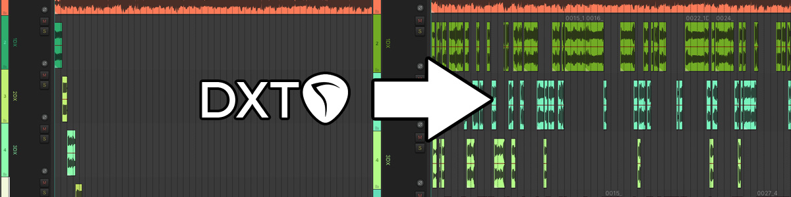
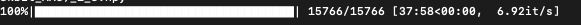

# DxTracker for Reaper

Track different speakers in your Reaper session using AI (Resemblyzer).

https://github.com/resemble-ai/Resemblyzer

## Requirements

### Python >= 3.7 

- SoundFile==0.10.2
- numpy==1.18.5
- tqdm==4.47.0
- Resemblyzer==0.1.1.dev0
- reapy==0.0
- rpp==0.4

## Description

This script puts together Reaper functionalities and modern A.I. implementations for voice recognition into a single workflow tool for identifying multiple speakers in an audio track. It does it by getting the Embeded Utterance (EU) of each speaker and a set of EU frames for the guide track, then it compares all speakers with each frame using scalar/dot product in a mutually exclusive way. 

- Recommended duration for Speaker Sample is 5 to 30 seconds (> 10 is best). 
- The DxTracker.py script will pull data from Reaper and identify which items are meant to be Speaker Samples and which one is the guide track, as well as saving relevant project data in the DxTracker.ini file for the trackdx.py script to read.
- The EUF (Embeded Utterance Frames) for the guide track are stored on the 'euframes' folder as a .npy file for future runs.

The results are great on interviews and they may vary depending on the Speaker Samples and EUF granularity config. The applications are many within the Reasemblyzer possibilities, for example, finding off-axis takes for a single Dx track based on in-axis and off-axis speaker samples for the same actor, etc.

## Installation (Reaper)

1. Put contents of the REAPER folder in your Reaper Media folder. (Find it with: Options > 'Show REAPER resource path in explorer/finder')
2. Add new action, 'Load Reascript' and find 'DxTracker.py' in your Reaper Media > DxTracker folder.
3. (Optional) Add it to a toolbar and use icon from the Data > toolbar_icons folder.

## Installation (Conda Environment)

(WIP) Explain how to install conda and make an environment for Resemblyzer

## Configuration

You can modify some values in DxTracker.ini 

`hoplength = 1` `framelength = 3` Granularity of Embeded Utterance Frames for guide track (in seconds).

`threshold = 0.9` The score/confidence threshold for returning a frame (ratio).

`overlapitems = True` Resultant items can overlap between different Dx tracks (based on hop and frame length).

Other variables are meant for the project data.

## How to Use

Step 1: Setup your session for Guide Track and number of speakers (4 in this case)

Step2: Cut Speaker Samples (around 10 seconds) from guide track (or other sources) and drag them to their respective Dx tracks.

Step3: Select all items to process (Speaker Samples and guide track) and run the DxTracker action.

Step4: Open Terminal and run trackdx.py in the DxTracker directory and the conda environment.

Step5: Once the script is done, open new project 'PROJECTNAME_dxtracker.RPP' in the same directory of the original project.

## Observations

The original resemblyzer demo used real time speaker identification to read an interview and plot the speaker confidence. For DxTracker, as it is designed for audio post, I changed it to what I found most efficient for Reaper, which is having items that reference the guide track file instead of something like generating new audio stems from the GT.

Everything related to Reaper and comparing Utterance is really efficient and it is done within seconds, what takes time is processing the guide track into EUFrames, and mostly depends on the Resemblyzer CPU/GPU configuration. For example, it took around 38 minutes to process a 4.3 hour, 44.1khz 16bit podcast with the hop, frame = 1, 3 setting with a 3.7 GHz Quad-Core Intel Xeon E5 CPU. Performance may vary, so go make a coffee in the meantime or watch some NBA highlights in your phone.

Luckily, there is a progress bar.

I'm open to suggestions btw.

